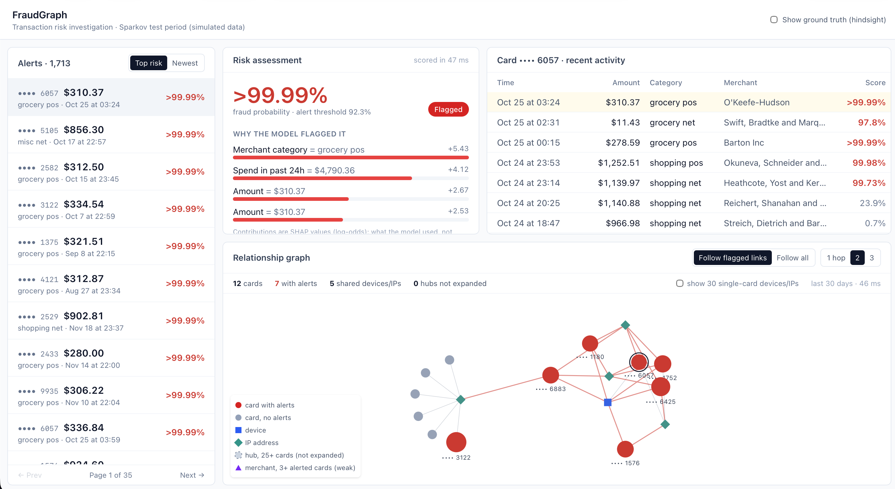
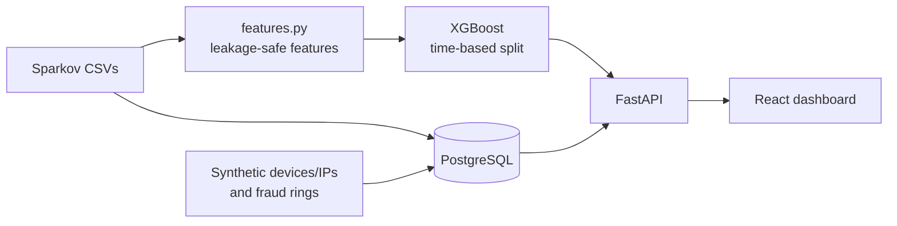

# FraudGraph

[](https://github.com/PatelPrince11/FraudGraph/actions/workflows/ci.yml)

A fraud investigation tool for card transactions. It scores every transaction with a
gradient-boosted model built on behavioural features, explains each alert, and links
cards through shared devices and IP addresses so an analyst can see whether one alert
is part of a larger ring.



**Demo flow:** pick an alert → see the risk score and the features that drove it → check
the card's recent activity → open the relationship graph to find other cards that used
the same devices or IPs.

## Results

Test set: 555,719 transactions from the last six months of the data (0.39% fraud), never
seen during training or threshold selection.

| Metric | Value |
|---|---|
| PR-AUC | **0.973** |
| PR-AUC, amount-only baseline | 0.137 |
| Precision / recall at the alert threshold | 99.6% / 79.5% |
| Alerts raised | 1,713 (0.31% of transactions) |
| Online vs offline feature parity | 300 / 300 transactions identical on all 20 features |
| Scoring latency, full path (DB + features + model + SHAP) | p50 32 ms, p95 57 ms |
| Relationship graph on injected rings (default mode) | 81% precision, 88% recall, p95 31 ms |

PR-AUC is the headline instead of ROC-AUC (0.999): at 0.4% fraud, ROC-AUC barely moves
between a good and a mediocre model. The amount-only baseline shows the gain comes from
the behavioural features, not from "large amounts are suspicious".

## How it works



- **Features** (`backend/app/features.py`): velocity over 1h/24h/7d, amount relative to the
  card's own history, distance from home, implied travel speed between purchases, merchant
  novelty. Each feature for a transaction uses only that card's *earlier* transactions,
  and a test enforces it by adding a future transaction and checking that nothing earlier changes.
- **Model** (`scripts/train.py`): XGBoost with a three-way time split. Early stopping and the
  alert threshold come from a validation period; the test period is touched once. The
  threshold targets an analyst review budget (0.5% of transactions) instead of 0.5 probability.
- **Serving** (`app/service.py`): the API rebuilds a transaction's features from the card's
  history in Postgres using the same `build_features` function as training, so training and
  serving can't drift apart. `scripts/check_parity.py` checks this on real data.
- **Explanations**: exact TreeSHAP values from XGBoost (`pred_contribs`); a test checks that
  they sum to the model's raw output.
- **Relationship graph** (`app/graph.py`): expands from a card to the devices/IPs it used and
  on to other cards, limited to the 30 days before the alert (no future data). Entities
  shared by 25+ cards (public Wi-Fi, carrier IPs) are shown but not expanded. By default it
  only follows devices/IPs that carried a flagged charge: 81% precision vs 33% when
  following everything, for 88% vs 98% recall.

## Honest limitations

- **The transaction data is simulated** ([Sparkov](https://www.kaggle.com/datasets/kartik2112/fraud-detection)),
  so the model scores higher than it would on real data. Its most confident alerts
  (~$300 grocery purchases late at night) are a pattern the simulator plants.
- **Devices, IPs and fraud rings are synthetic.** No public dataset links cards to devices.
  They live in separate tables and are never model inputs, so the model metrics above are
  unaffected. The graph metrics show the query logic works on rings with a known answer;
  they are not evidence about real-world ring detection.
- **In default mode the graph only sees what the model sees**: if the model misses every
  charge on a shared device, the graph can't follow that link. A model-independent rule
  (e.g. one device used by 4+ cards in a day) would fix this and isn't built yet.
- **The threshold drifts:** it was set on a period with 0.58% fraud and raised fewer alerts
  than budgeted on the test period (0.31% vs 0.5%). Production systems re-set it from recent traffic.
- **Serving rebuilds features from full card history**, which is most of the scoring time and
  grows with card age. A per-card running summary would be O(1) but is a second
  implementation to keep in sync.

## Run it

Needs Docker, Python 3.13, Node 22, and the two CSVs from the Kaggle link above in `data/raw/`.

```bash
# 1. Features and model (from backend/)
cd backend
python -m venv .venv && source .venv/bin/activate
pip install -r requirements-dev.txt
python -m scripts.build_features
python -m scripts.train

# 2. Database (from repo root), then load it (from backend/)
docker compose up -d db
cp .env.example .env
python -m scripts.load_db
python -m scripts.check_parity
python -m scripts.score_all
python -m scripts.make_graph_overlay

# 3. Whole stack (from repo root)
docker compose up --build -d
# dashboard: http://localhost:8080    API docs: http://localhost:8000/docs
```

For development, run `uvicorn app.main:app --reload` in `backend/` and `npm run dev` in
`frontend/` (http://localhost:5173) instead of step 3.

## Tests and CI

`pytest` in `backend/` runs 22 tests on synthetic data. They run on SQLite by default, or on
PostgreSQL with `TEST_DATABASE_URL` set. GitHub Actions runs both on every push, plus the
frontend typecheck and build, and builds both Docker images. The Postgres run matters: it caught
a bug SQLite can't (money stored as `NUMERIC(12,2)` rounds amounts, so unrounded test data
broke online/offline parity only on Postgres).

## Stack

Python · pandas · XGBoost · scikit-learn · NetworkX · FastAPI · SQLAlchemy · PostgreSQL ·
React · TypeScript · Tailwind · Vite · Docker · nginx · GitHub Actions
